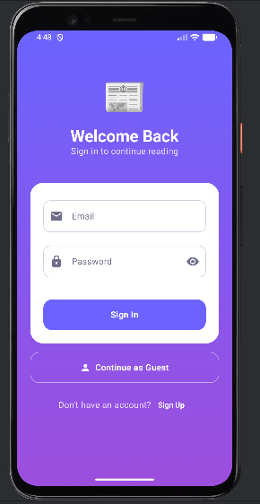
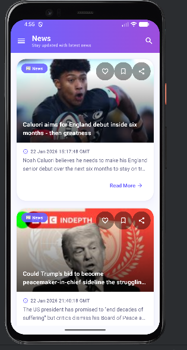
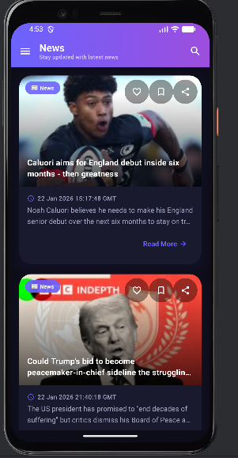
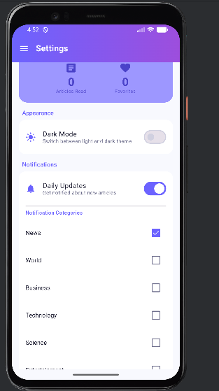
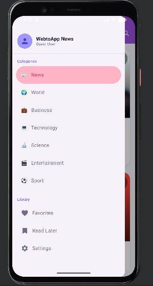

# 📰 BBC News App

A modern Android news reader app built with **Jetpack Compose**, **Firebase Authentication**, and **Clean Architecture**.


## ✨ Features

### 🔐 Authentication
| Feature | Description |
|---------|-------------|
| 📧 **Email/Password Login** | Secure authentication with Firebase |
| 📝 **User Registration** | Create new accounts easily |
| 👤 **Guest Mode** | Browse without creating an account |
| 🗑️ **Account Deletion** | Permanently delete account and data |

### 📱 News Experience
| Feature | Description |
|---------|-------------|
| 🎨 **Modern UI** | Material 3 design with gradient TopBar, glassmorphism effects |
| 🌙 **Dark Mode** | Full dark theme support |
| 📂 **7 Categories** | News, World, Business, Technology, Science, Entertainment, Sport |
| ❤️ **Favorites** | Save articles for quick access |
| 🔖 **Read Later** | Bookmark articles to read when you have time |
| 🔍 **Search** | Filter news by keyword in real-time |
| 📤 **Share** | Share articles with friends |
| 🔄 **Pull-to-Refresh** | Swipe down to refresh content |

### 🛠️ Settings & Personalization
| Feature | Description |
|---------|-------------|
| 🔔 **Smart Notifications** | Daily reminders with category filters |
| 📊 **Reading Statistics** | Track articles read and favorites count |
| 📶 **Offline Support** | Read cached articles without internet |
| 🧹 **Cache Management** | Clear saved data anytime |

## 📸 Screenshots

<p align="center">
  
  
  
  
  
</p>


## 🏗️ Architecture

This project follows **Clean Architecture** with **MVVM** pattern:

```
app/
├── data/
│   ├── local/        # Room Database, DataStore
│   ├── remote/       # Retrofit API (BBC RSS)
│   └── repository/   # Repository implementations, AuthRepository
├── domain/
│   ├── model/        # Domain models
│   ├── repository/   # Repository interfaces
│   └── usecase/      # Use cases
├── ui/
│   ├── auth/         # Login, Register screens
│   ├── components/   # Reusable Compose components
│   ├── home/         # Home screen
│   ├── favorites/    # Favorites screen
│   ├── settings/     # Settings screen
│   └── theme/        # App theme (colors, typography)
├── di/               # Dependency Injection (Hilt)
└── worker/           # Background workers (Notifications)
```

## 🛠️ Tech Stack

| Category | Technologies |
|----------|-------------|
| **UI** | Jetpack Compose, Material 3 |
| **Architecture** | MVVM, Clean Architecture |
| **Auth** | Firebase Authentication |
| **DI** | Hilt (Dagger) |
| **Networking** | Retrofit, OkHttp |
| **Database** | Room |
| **Preferences** | DataStore |
| **Background** | WorkManager |
| **Image Loading** | Coil |
| **Fonts** | Google Fonts (Poppins, Nunito) |

## 🚀 Getting Started

### Prerequisites
- Android Studio Hedgehog or later
- JDK 17+
- Android SDK 34
- **Firebase Configuration:**

> ⚠️ **Important:** This project uses Firebase Authentication. For security reasons, the `google-services.json` file is not included in the repository.
>
> 1. Create a project in [Firebase Console](https://console.firebase.google.com/).
> 2. Enable **Authentication** (Email/Password).
> 3. Download your `google-services.json` file.
> 4. Place it in the `app/` directory of the project.
> 5. Sync Gradle and Run.


## 📄 License

```
MIT License

Copyright (c) 2025 [Melike Nur Özün]

Permission is hereby granted, free of charge, to any person obtaining a copy
of this software and associated documentation files (the "Software"), to deal
in the Software without restriction, including without limitation the rights
to use, copy, modify, merge, publish, distribute, sublicense, and/or sell
copies of the Software.
```

## 🤝 Contributing

Pull requests are welcome! For major changes, please open an issue first.

---
## 📧 Contact

Developed by **Melike Nur Özün**
- 📩 [melikenurozun@gmail.com](mailto:melikenurozun@gmail.com)
